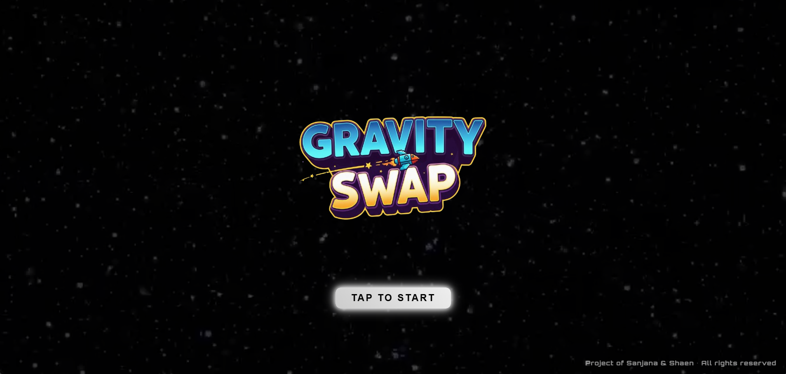
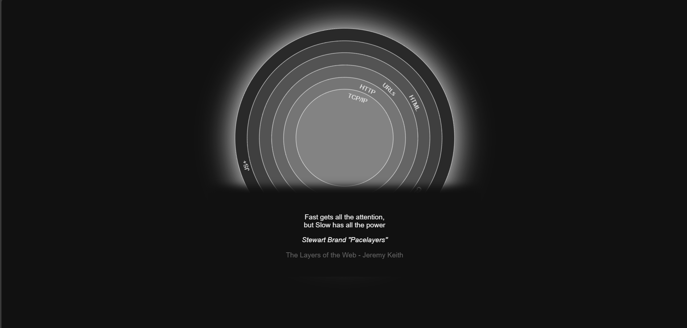
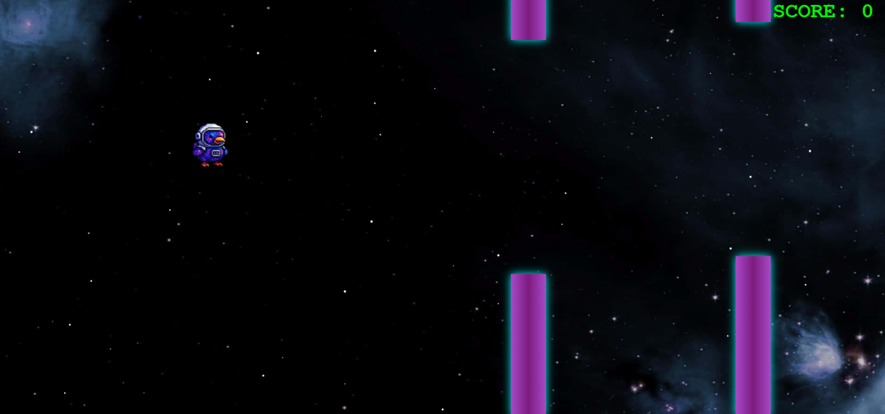
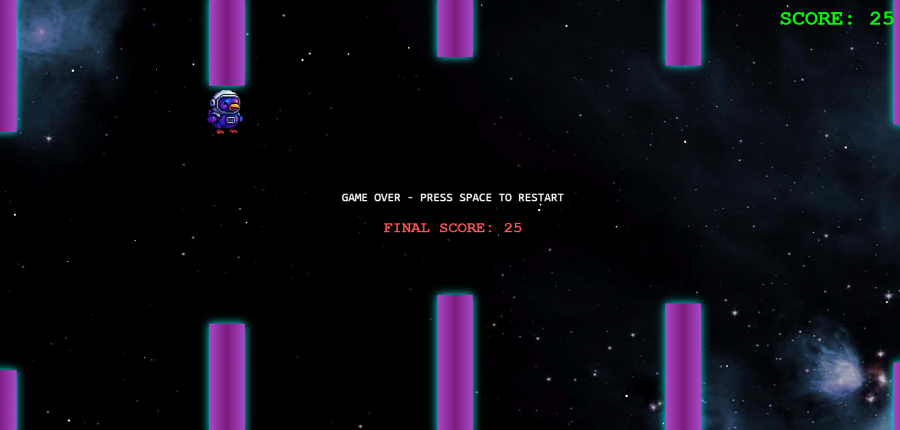

# Gravity Swap 🎯

## Basic Details
### Team Name: Pixel Perfect

### Team Members
- Team Lead: Sanjana Sujith - Muthoot Institute of Technology and Science
- Member 2: Shaen Meryl Saj - Muthoot Institute of Technology and Science

### Project Description
A twist on the classic Flappy Bird game where gravity changes every 5 seconds.
Players start by preventing the bird from falling, then must suddenly adapt to stop it from flying upwards.
This constant reversal forces quick reflexes and adaptability, making it far more chaotic and fun.

### The Problem (that doesn't exist)
The original Flappy Bird is simple and predictable, making it easy for players to get used to its mechanics.
We wanted to introduce an extra challenge that disrupts rhythm and keeps players on edge.

### The Solution (that nobody asked for)
We created a gameplay mechanic where gravity reverses periodically, forcing players to continuously relearn movement patterns.
This unpredictability increases difficulty and adds a unique twist for both casual and competitive play.

## Technical Details
### Technologies/Components Used
For Software:
- Languages used-
   1.HTML5-Structuring the web pages (`<video>`, `<canvas>`, `<audio>`, buttons, images, etc.)
   2.CSS-Styling animations, layout, buttons, fonts, background effects                    
   3.JavaScript-Main logic for animations, interactivity, canvas drawing, gravity flip mechanics  
- Frameworks used-There are no JavaScript frameworks used in this project. The project is built using pure JavaScript.
- Libraries used-
    1.Google Fonts(Orbitron, PressStart2P)-Custom sci-fi and retro game fonts
    2.Web APIs (built-in)	
- Tools used-
    1.HTML5-Used for drawing and animating the flappy bird–style game                               
    2.CSS Keyframes-Used to animate logo scaling, stars, button pulses, etc.                                

### Implementation
For Software:
# Installation
This is a browser-based game implemented using HTML, CSS, and JavaScript. No installation of frameworks or compilers is required. All code runs natively in the browser.

# Run
Run via local file-
Download the full project folder.
Open index.html in your browser.
Click "TAP TO START" to begin.

### Project Documentation
For Software:

# Screenshots (Add at least 3)

This screenshot is showing the Intro page.

This screenshot is showing the loading page.

This screenshot is showing the game mechanism.

This screenshot is showing the end of the game.

 
### Project Demo
# Video
(https://drive.google.com/file/d/1IFnURAd_3h866LQJtrIHDHO4ghENzJAb/view?usp=drivesdk)
This shows the working of our game

## Team Contributions
- Sanjana Sujith: They developed the core game mechanics, implemented the physics, and established the rules to ensure smooth and engaging gameplay. Their work laid the foundation for how the game functions and interacts with players.

- Shaen Meryl Saj: They crafted the UI/UX design to create an intuitive and visually appealing interface, while also composing and integrating music and sound effects to enhance the overall player experience. Their contributions brought polish and immersion to the game.
  

---
Made with ❤️ at TinkerHub Useless Projects 

